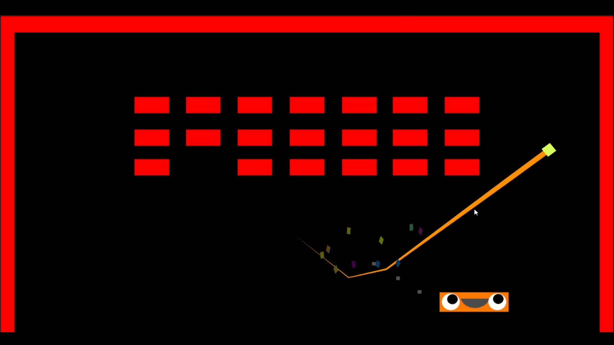
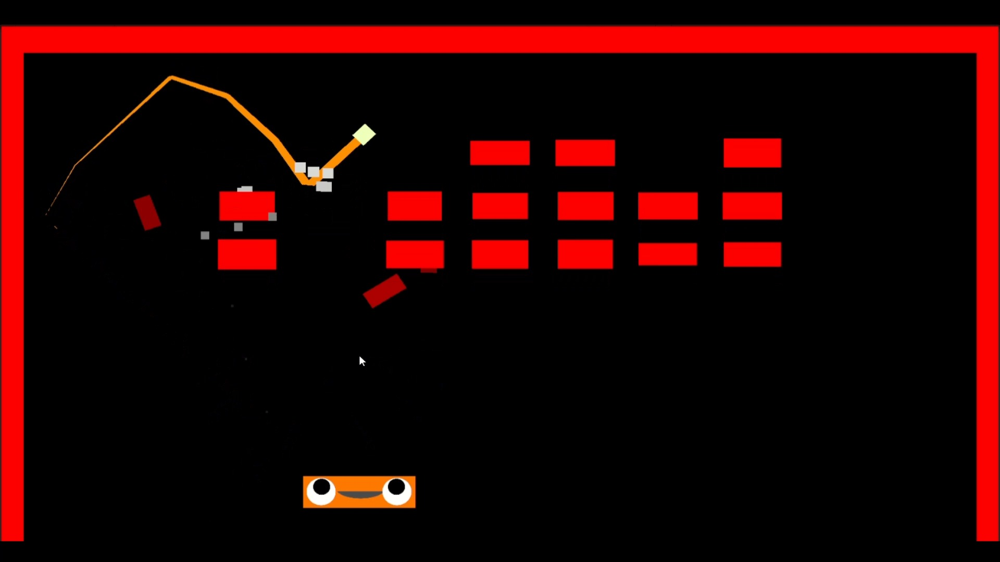

# Brick Braker Clone
This project is made for the MASOMO game developer internship program. 
In my 7 weeks of training one of my tasks was to make a clone of the brick breaker game from this [presentation](https://www.youtube.com/watch?v=Fy0aCDmgnxg).
I made this project with Unity and C#. All the code and particles are created by me except sound fx.
The aim of this project is how polishing a simple game effects the game feel. While making the project I learned how important the game feel is. 

## How To Play
This is a clone of the brick breaker game. You can play the game with a mouse. You try to break all the bricks without dropping the ball. 
You can adjust the balls bounce from the paddle  according to the touch point of the ball on the paddle. The more it lands on the edges the more it bounces to that direction.

## Unity Version
- 2022.3.5f1

## Preview
### [For More Gameplay](https://youtu.be/h0dxdUsrg9E)

  
  

  
  

  
