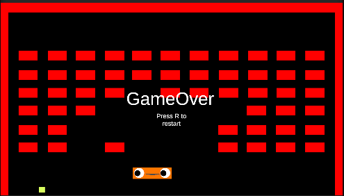
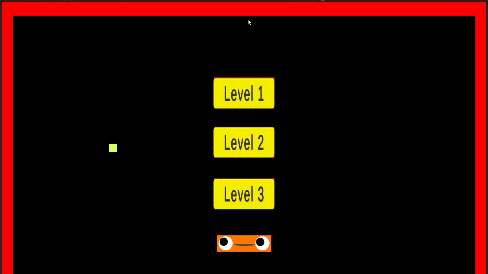
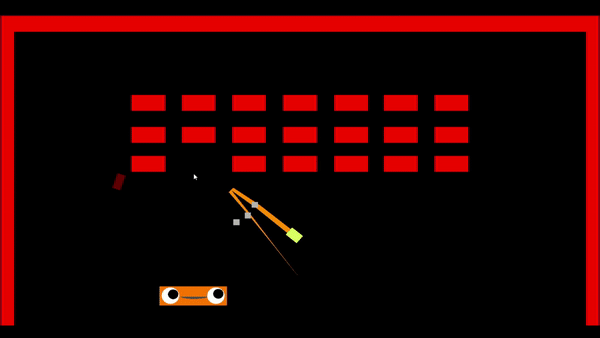
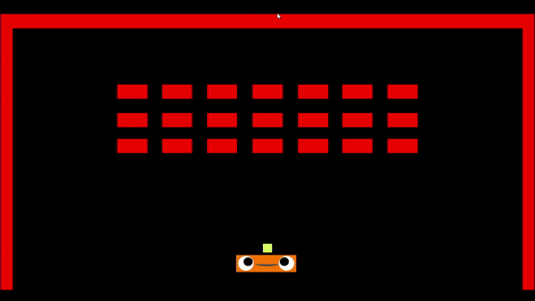
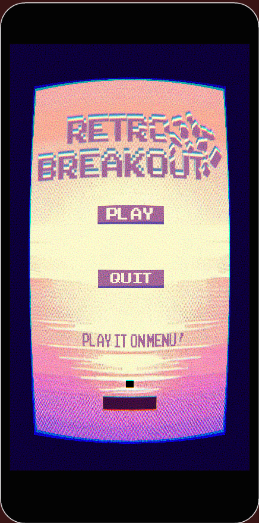
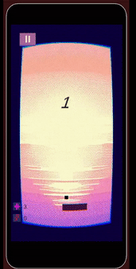
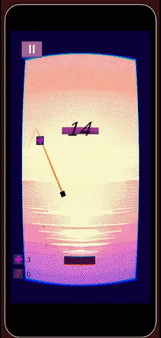

# Brick Braker Clone
This project is made for the MASOMO game developer internship program. 
In my 7 weeks of training one of my tasks was to make a clone of the brick breaker game from this [presentation](https://www.youtube.com/watch?v=Fy0aCDmgnxg).
I made this project with Unity and C#. All the code and particles are created by me except sound fx.
The aim of this project is to see how polishing a simple game affects the game feel. While making the project I learned how important the game feel is. 

After compleeting the game I decided to make a mobile version of the clone but while turning it to a mobile game I wanted to change the game flow and come up with the idea of endless breakout game. I aim to keep the particles and visual effects but I keep some of them only. 2D arts are made by Tolga Varlı. 
In this verison aim is to keeping the ball bouncing while avoiding the breaks to hit us. 

## How To Play

### Clone

This is a clone of the brick breaker game. You try to break all the bricks without dropping the ball. 
You can adjust the ball's bounce from the paddle  according to the touch point of the ball on the paddle. The more it lands on the edges the more it bounces to that direction.
- Mouse to move paddle.
- Esc to pause and resume.
- R to restart the current level.
  
### Mobile  RetroBreakout

- Tao to mobe paddle
- You can pause with the button
- Double tap to shoot laser.
- You can charge your laser with laser powerup.
- You can slow time with slowmo powerup.
- You can heal with health pwoerup.
   
## Itch.io
You can play it on your browser or by downloading it from the Itch.io page: [BrickBrakerClone](https://satas20.itch.io/brickbrakerclone).

You can download it from the Play Store: [RetroBreakout GooglePlay](https://play.google.com/store/apps/details?id=com.ataayyldz.retrobreakout).

## Preview

### Clone Version 

### [For More Gameplay](https://youtu.be/h0dxdUsrg9E)

  
  

  
  

### RetroBreakout

  
  
  
  

## Unity Version
- 2022.3.5f1

  
